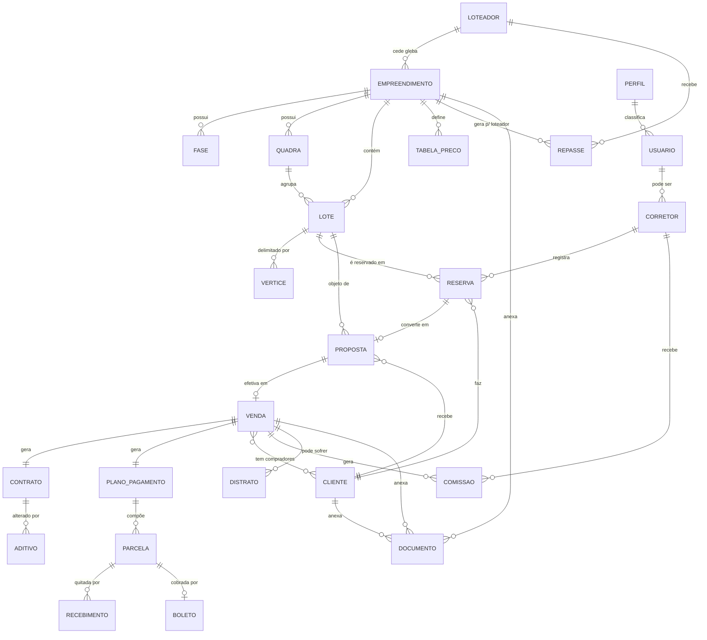
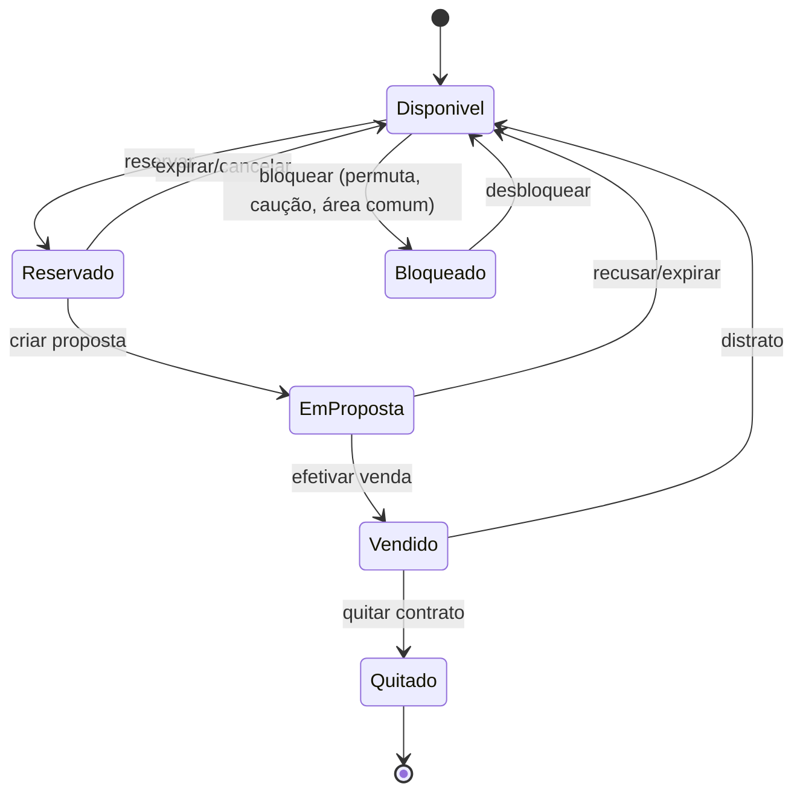

# 02 — Modelo de Domínio

Entidades principais, relacionamentos e glossário do sistema de gestão de
empreendimentos imobiliários rurais.

- [1. Diagrama entidade-relacionamento (ER)](#1-diagrama-entidade-relacionamento-er)
- [2. Entidades principais](#2-entidades-principais)
- [3. Máquina de estados do lote](#3-máquina-de-estados-do-lote)
- [4. Glossário](#4-glossário)

---

## 1. Diagrama entidade-relacionamento (ER)

> Visão conceitual (não físico/tabelas). Renderiza como diagrama no GitHub.

## 2. Entidades principais

### Núcleo geográfico/comercial

| Entidade | Descrição | Atributos-chave |
|----------|-----------|-----------------|
| **Loteador / Proprietário** | Dono da gleba que origina o empreendimento; recebe repasses. | nome/razão social, documento, dados bancários, % ou regra de repasse |
| **Empreendimento** | Loteamento/condomínio rural gerido pela imobiliária. | nome, tipo, município/UF, área total, matrícula-mãe, cartório, CCIR, CAR, situação, perímetro (polígono), datum |
| **Fase / Etapa** | Recorte de lançamento do empreendimento. | nome, ordem, situação, % infraestrutura |
| **Quadra / Setor** | Agrupamento de lotes. | identificação, empreendimento |
| **Lote** | Unidade comercializável. | nº, quadra/fase, tipo/uso, **área**, **perímetro**, **dimensões** (frente/fundos/laterais), características (topografia, esquina), matrícula individual, **status**, preço base, valor/m² |
| **Vértice** | Ponto do polígono do lote. | ordem, coordenada (lat/long ou E/N), datum |
| **Tabela de Preço** | Preços vigentes por empreendimento/período. | vigência, valores, fatores de valorização |

### Núcleo de pessoas

| Entidade | Descrição | Atributos-chave |
|----------|-----------|-----------------|
| **Cliente / Comprador** | PF ou PJ que adquire lote(s). | tipo (PF/PJ), documento, contatos, endereço, estado civil/cônjuge, renda, dados bancários, consentimentos LGPD |
| **Corretor** | Vendedor (interno ou de imobiliária parceira). | nome, CRECI, imobiliária, comissão padrão, metas |
| **Usuário** | Conta de acesso ao sistema. | login, credenciais, perfil, empreendimentos permitidos |
| **Perfil** | Conjunto de permissões (RBAC). | nome, permissões por módulo/ação |

### Núcleo comercial/contratual

| Entidade | Descrição | Atributos-chave |
|----------|-----------|-----------------|
| **Lead** | Interessado no funil de vendas. | origem, etapa do funil, corretor, interações |
| **Reserva** | Bloqueio temporário de um lote. | lote, cliente/lead, corretor, data, expiração, status |
| **Proposta** | Oferta comercial com condições. | lote, cliente, corretor, condições (entrada, parcelas, índice, desconto), status/aprovação, versões |
| **Venda** | Negócio efetivado. | nº, lote, compradores, corretor, valor, condições, data, status |
| **Contrato** | Instrumento jurídico da venda. | modelo, conteúdo, status de assinatura, anexos |
| **Aditivo** | Alteração contratual. | tipo, conteúdo, data |
| **Distrato** | Rescisão da venda. | motivo, cálculo de devolução, cronograma, data |

### Núcleo financeiro

| Entidade | Descrição | Atributos-chave |
|----------|-----------|-----------------|
| **Plano de Pagamento** | Cronograma financeiro da venda. | entrada, nº parcelas, índice, juros, método (Price/SAC) |
| **Parcela** | Item do plano de pagamento. | número, tipo (entrada/mensal/balão/final), vencimento, valor, saldo, status |
| **Boleto / Cobrança** | Documento de cobrança da parcela. | nosso número, linha digitável/PIX, vencimento, valor, status |
| **Recebimento** | Baixa de pagamento. | parcela, valor, data, forma, origem (manual/CNAB/PIX) |
| **Comissão** | Valor devido a corretor/parceiro por venda. | venda, beneficiário, base, %, valor, regra de pagamento, status |
| **Repasse** | Valor devido ao loteador/proprietário. | empreendimento/venda, base, valor, status |

### Suporte

| Entidade | Descrição |
|----------|-----------|
| **Documento** | Arquivo anexado a empreendimento, lote, cliente, venda ou contrato (GED). |
| **Interação** | Registro de contato/atendimento na linha do tempo do lead/cliente. |
| **Log de Auditoria** | Registro imutável de operação sensível (quem/quando/o quê). |
| **Parâmetro** | Configuração do sistema (índices, taxas, alçadas, templates, régua). |

## 3. Máquina de estados do lote

O status do lote é o coração do "espelho de vendas". Transições típicas:

Regras associadas em [`03-regras-de-negocio.md`](03-regras-de-negocio.md).

## 4. Glossário

Termos do setor imobiliário rural e do domínio do sistema.

| Termo | Significado |
|-------|-------------|
| **Empreendimento** | Projeto imobiliário (loteamento/condomínio rural) subdividido em lotes para venda. |
| **Loteamento** | Subdivisão de gleba em lotes com abertura/prolongamento de vias. |
| **Desmembramento** | Subdivisão de gleba em lotes aproveitando o sistema viário existente. |
| **Condomínio (fração ideal)** | Modelo em que o comprador adquire fração ideal do todo, com uso de uma unidade. |
| **Gleba** | Área de terra ainda não parcelada. |
| **Lote / Parcela** | Unidade individual resultante do parcelamento, objeto da venda. |
| **Quadra** | Agrupamento de lotes delimitado por vias. |
| **Matrícula** | Registro do imóvel no Cartório de Registro de Imóveis; a "matrícula-mãe" origina as individuais. |
| **Georreferenciamento** | Definição das coordenadas dos vértices do imóvel em um sistema geodésico. |
| **Datum / SIRGAS 2000** | Referencial geodésico oficial no Brasil para coordenadas. |
| **UTM** | Sistema de projeção cartográfica (coordenadas em metros, E/N). |
| **Dimensões planas** | Medidas e área projetadas no plano horizontal (independentes do relevo). |
| **Perímetro** | Comprimento total do contorno do lote. |
| **Confrontações** | Limites/confrontantes de cada face do lote. |
| **APP** | Área de Preservação Permanente (não edificável/não comercializável). |
| **Reserva Legal** | Percentual da propriedade rural a ser preservado. |
| **CAR** | Cadastro Ambiental Rural. |
| **CCIR** | Certificado de Cadastro de Imóvel Rural (INCRA). |
| **ITR** | Imposto sobre a Propriedade Territorial Rural. |
| **VGV** | Valor Geral de Vendas (soma do potencial/realizado de vendas). |
| **Espelho de vendas** | Visão consolidada do estoque com o status de cada lote. |
| **Reserva** | Bloqueio temporário de um lote para um cliente durante a negociação. |
| **Proposta** | Oferta formal de compra com condições comerciais. |
| **Distrato** | Rescisão do contrato de compra e venda. |
| **Financiamento próprio / Carteira** | Parcelamento concedido diretamente pela loteadora/imobiliária. |
| **Balão / Intermediária** | Parcela de maior valor em intervalos (anual/semestral). |
| **Correção monetária** | Atualização do saldo devedor por um índice (INCC, IGP-M, IPCA). |
| **Price / SAC** | Sistemas de amortização de financiamento (parcelas fixas / amortização constante). |
| **CNAB** | Padrão de arquivo de remessa/retorno bancário (240/400 posições). |
| **Régua de cobrança** | Sequência automatizada de avisos de vencimento/atraso. |
| **Inadimplência (aging)** | Situação e faixas de atraso das parcelas vencidas. |
| **Comissão / Split** | Remuneração da venda e sua divisão entre os envolvidos. |
| **Repasse** | Valor transferido ao loteador/proprietário conforme contrato. |
| **RBAC** | Controle de acesso baseado em papéis (perfis e permissões). |
| **GED** | Gestão Eletrônica de Documentos. |
