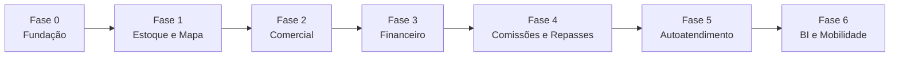

# 04 — Backlog de Funcionalidades e Roadmap

Priorização das funcionalidades (MoSCoW) e proposta de roadmap em fases.
Referencia os requisitos de [`01-requisitos.md`](01-requisitos.md).

- [1. Épicos e histórias de usuário](#1-épicos-e-histórias-de-usuário)
- [2. Priorização MoSCoW](#2-priorização-moscow)
- [3. Roadmap sugerido em fases](#3-roadmap-sugerido-em-fases)
- [4. Critérios de aceite (exemplos)](#4-critérios-de-aceite-exemplos)

---

## 1. Épicos e histórias de usuário

Formato: **Como** \<ator\>, **quero** \<ação\>, **para** \<valor\>.

### Épico A — Cadastro e Estoque Georreferenciado
- Como **backoffice**, quero cadastrar um empreendimento e importar seus lotes a
  partir de um arquivo geográfico simples (KML/GeoJSON) ou planilha, **para** montar o
  estoque sem digitação manual. *(RF-EMP-001, RF-LOT-010)*
- Como **backoffice**, quero que a **área e o perímetro** de cada lote sejam
  calculados automaticamente a partir dos vértices, **para** conferir com o
  memorial descritivo. *(RF-LOT-004, RN-058)*

### Épico B — Mapa / Espelho de Vendas
- Como **corretor**, quero ver os lotes no mapa **coloridos por status**, **para**
  apresentar rapidamente o que está disponível. *(RF-MAP-002)*
- Como **corretor**, quero **reservar um lote pelo mapa**, **para** agilizar o
  atendimento. *(RF-MAP-004, RF-RES-001)*

### Épico C — Funil Comercial
- Como **corretor**, quero registrar leads e suas interações, **para** organizar
  meu atendimento. *(RF-CRM-001, RF-CRM-005)*
- Como **gestor**, quero aprovar propostas com desconto acima da alçada, **para**
  manter a política comercial. *(RF-VEN-003, RN-025)*

### Épico D — Venda e Contrato
- Como **corretor**, quero **simular condições de pagamento** e fechar a venda,
  **para** converter a negociação. *(RF-VEN-002, RF-VEN-006)*
- Como **jurídico**, quero gerar o contrato por template e enviá-lo para
  **assinatura eletrônica**, **para** formalizar com agilidade. *(RF-CTR-001,
  RF-CTR-003)*

### Épico E — Financeiro / Recebíveis (Carteira)
- Como **financeiro**, quero gerar o **carnê** com correção e emitir boletos,
  **para** cobrar as parcelas. *(RF-FIN-001, RF-FIN-003)*
- Como **financeiro**, quero **baixar pagamentos automaticamente** pelo retorno
  bancário, **para** reduzir trabalho manual. *(RF-FIN-004, RN-033)*
- Como **financeiro**, quero uma **régua de cobrança** e um painel de
  inadimplência, **para** reduzir a perda. *(RF-FIN-006, RF-FIN-007)*
- Como **financeiro**, quero processar **distratos** com o cálculo de devolução,
  **para** encerrar contratos corretamente. *(RF-FIN-010, RN-040)*

### Épico F — Comissões e Repasses
- Como **gestor**, quero que a **comissão** seja calculada e dividida no split
  automaticamente, **para** pagar corretamente os envolvidos. *(RF-COM-003,
  RN-051)*
- Como **financeiro**, quero calcular os **repasses ao loteador**, **para**
  honrar o contrato de parceria. *(RF-FCX-002, RN-055)*

### Épico G — Portais
- Como **cliente**, quero emitir a **2ª via do boleto** e ver meu extrato,
  **para** me autoatender. *(RF-PCL-002, RF-PCL-003)*
- Como **corretor**, quero acessar o **estoque e minhas comissões** pelo celular,
  **para** trabalhar em campo. *(RF-PCO-001, RF-PCO-005)*

### Épico H — Gestão e Indicadores
- Como **diretoria**, quero um **dashboard de vendas e recebíveis**, **para**
  decidir com dados. *(RF-REL-001, RF-REL-003)*
- Como **administrador**, quero gerir **perfis e permissões**, **para** controlar
  o acesso. *(RF-ADM-002)*

## 2. Priorização MoSCoW

### Must (MVP)
Cadastro de empreendimentos (com **os dois modelos jurídicos**: matrícula
individual e fração ideal) e lotes com **georreferenciamento simplificado**
(coordenadas + dimensões planas) e cálculo de área/perímetro; importação
geográfica (KML/GeoJSON/planilha); mapa/espelho de vendas por status; CRM básico
e reservas; propostas com simulação e alçadas nas **três formas de pagamento**
(à vista, bancário, próprio); efetivação de venda; geração de contrato por
template; **plano de pagamento do financiamento próprio com juros mensais e
correção IGP-M a partir do 13º mês, boletos e baixa (manual + CNAB)**;
inadimplência básica; distrato; comissão com split (à vista e conforme
recebimento); usuários/RBAC e auditoria; dashboard comercial e espelho
exportável.

*(RF-EMP-001/002/005/006/008/009/010/011, RF-LOT-001..004/006/008/009/010/012,
RF-MAP-001..006, RF-CRM-001/003/005/007/010, RF-RES-001..003/007,
RF-VEN-001..003/005..008, RF-CTR-001/002/005/007, RF-FIN-001..005/007/010/012,
RF-COM-001..004, RF-GED-001, RF-REL-001..003, RF-ADM-001/002/004/005,
RNF-001..004/007..009/011/012)*

### Should
Captação automática de leads e distribuição; visitas; assinatura eletrônica;
régua de cobrança; renegociação e antecipação; informe de IR; extrato de
comissões e regra "conforme recebimento"; contas a pagar/receber, repasses e
exportação contábil; checklist documental; portal do cliente e do corretor
(web); multiempresa; relatórios de comissão e repasse; mensageria; validações
Receita/CEP.

### Could
Camadas informativas do mapa (APP/Reserva Legal), medição e modo apresentação;
fila de espera em reservas; remembramento/desmembramento; detecção de
sobreposição geométrica; metas/performance; conciliação bancária; relatórios
customizáveis; controle de validade documental; BI externo; acompanhamento de
registro em cartório.

### Won't (por ora)
**App mobile** (nesta etapa o acesso é somente via navegador); **interface de
topógrafo** e tratamento de **complexidade topográfica** (relevo, curvas de
nível, edição CAD/DWG); execução detalhada de obra/engenharia; contabilidade
fiscal completa; cartório eletrônico; portal público de anúncios próprio.
*(ver "Fora do escopo" em
[`01-requisitos.md`](01-requisitos.md#12-fora-do-escopo-nesta-versão))*

## 3. Roadmap sugerido em fases

> Sequência lógica de entregas. Datas/estimativas dependem do time e das
> definições em aberto (ver seção 9 de `01-requisitos.md`).

| Fase | Tema | Entregas principais |
|------|------|---------------------|
| **Fase 0 — Fundação** | Base técnica | Autenticação, RBAC, multiempresa, parametrização, auditoria, GED básico. |
| **Fase 1 — Estoque e Mapa** | "Ver e cadastrar" | Empreendimentos, lotes, importação geográfica, cálculo de área/perímetro, mapa/espelho de vendas por status. |
| **Fase 2 — Comercial** | "Vender" | CRM, reservas, propostas com simulação e alçadas nas **três formas de pagamento**, efetivação da venda, contrato por template (para os **dois modelos jurídicos**). |
| **Fase 3 — Financeiro** | "Receber" | Plano de pagamento do financiamento próprio (**juros mensais + IGP-M a partir do 13º mês**), boletos/PIX, baixa CNAB, inadimplência, distrato, extrato por contrato. |
| **Fase 4 — Comissões e Repasses** | "Distribuir" | Tabelas e split de comissão, extratos, repasses ao loteador, contas a pagar/receber. |
| **Fase 5 — Autoatendimento e Cobrança** | "Escalar" | Portal do cliente (boletos/extrato/IR), régua de cobrança, mensageria, assinatura eletrônica. |
| **Fase 6 — Inteligência e Mobilidade** | "Otimizar" | Dashboards avançados/BI, portal e app do corretor (offline), camadas avançadas do mapa, conciliação. |

## 4. Critérios de aceite (exemplos)

Exemplos no formato **Dado / Quando / Então** para orientar o refinamento.

**Importação de lotes (RF-LOT-010)**
- **Dado** um arquivo KML válido com 120 polígonos,
- **Quando** o backoffice importa no empreendimento X,
- **Então** os 120 lotes são criados com vértices, área e perímetro calculados,
  e um relatório de validação aponta eventuais sobreposições ou polígonos não
  fechados.

**Reserva com expiração (RF-RES-001, RN-010)**
- **Dado** um lote Disponível e um prazo de reserva de 48 h,
- **Quando** o corretor reserva o lote,
- **Então** o lote fica Reservado, indisponível para outros, e é liberado
  automaticamente se não houver proposta em 48 h.

**Simulação e alçada (RF-VEN-002/003, RN-025)**
- **Dado** um corretor com alçada de 5% de desconto,
- **Quando** ele monta uma proposta com 8% de desconto,
- **Então** a proposta fica pendente de aprovação do gestor antes de virar venda.

**Baixa automática por CNAB (RF-FIN-004, RN-033)**
- **Dado** um arquivo de retorno bancário com pagamentos do dia,
- **Quando** o financeiro processa o retorno,
- **Então** as parcelas correspondentes são baixadas (sem duplicidade) e o
  extrato do contrato é atualizado.

**Distrato (RF-FIN-010, RN-040/042)**
- **Dado** um contrato com 10 parcelas pagas,
- **Quando** o distrato é aprovado com retenção de 20%,
- **Então** o sistema calcula o valor a devolver, gera o cronograma de
  devolução, libera o lote (volta a Disponível) e ajusta as comissões.
