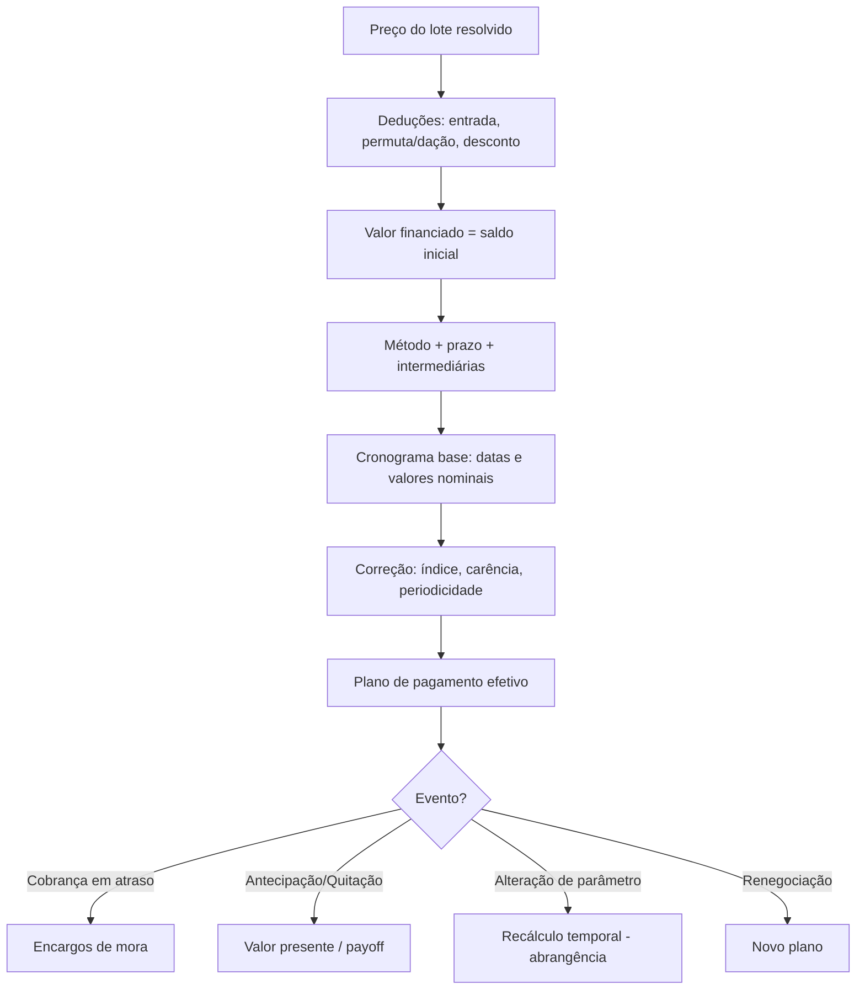

# 05 — Motor de Cálculo Financeiro

Especificação do módulo que calcula planos de pagamento, correção, juros,
encargos e recálculos. Detalha o módulo **Financeiro** ([`01-requisitos.md` §4.8](01-requisitos.md#48-módulo-financeiro--recebíveis-fin))
e consome os parâmetros do módulo **`PAR`** ([§3.1](01-requisitos.md#31-princípio-transversal--parametrização-hierárquica-com-herança)).

- [1. Objetivo e escopo](#1-objetivo-e-escopo)
- [2. Entradas do cálculo](#2-entradas-do-cálculo)
- [3. Pipeline de cálculo](#3-pipeline-de-cálculo)
- [4. Composição do valor financiado](#4-composição-do-valor-financiado)
- [5. Métodos de amortização](#5-métodos-de-amortização)
- [6. Correção monetária](#6-correção-monetária)
- [7. Encargos por atraso (mora)](#7-encargos-por-atraso-mora)
- [8. Antecipação e quitação (payoff)](#8-antecipação-e-quitação-payoff)
- [9. Arredondamento e precisão](#9-arredondamento-e-precisão)
- [10. Simulação x efetivação](#10-simulação-x-efetivação)
- [11. Recálculo e vigência temporal](#11-recálculo-e-vigência-temporal)
- [12. Memória de cálculo e auditoria](#12-memória-de-cálculo-e-auditoria)
- [13. Requisitos funcionais (RF-CALC)](#13-requisitos-funcionais-rf-calc)
- [14. Regras de cálculo (RC)](#14-regras-de-cálculo-rc)
- [15. Exemplos numéricos](#15-exemplos-numéricos)
- [16. Questões em aberto](#16-questões-em-aberto)

---

## 1. Objetivo e escopo

O motor é responsável por **todo cálculo monetário** do ciclo de recebíveis do
**financiamento próprio (carteira)**: simulação, geração do plano de pagamento,
correção, juros, encargos de atraso, antecipação, quitação, saldo devedor e
recálculos.

- **À vista**: caso trivial — não há juros nem correção; um único pagamento.
- **Financiamento bancário**: a loteadora recebe do agente financeiro (à vista,
  na liberação); o parcelamento cliente↔banco é **externo** ao motor. O sistema
  controla o processo e pode registrar o fluxo esperado, mas **não** gera carnê
  próprio.
- **Financiamento próprio**: foco deste documento.

**Princípios:**
- **Determinismo**: mesmas entradas ⇒ mesmo resultado (RC-15).
- **Rastreabilidade**: toda parcela e todo recálculo têm **memória de cálculo**
  (§12).
- **Parâmetros externos**: o motor **não** fixa taxas/índices; ele lê os
  **parâmetros resolvidos** pela cascata (`PAR`) e, no contrato, suas **versões
  temporais** (§11).

## 2. Entradas do cálculo

Todas resolvidas via `PAR` (cascata Geral→Empreendimento→Setor→Lote→Contrato) e,
no contrato, versionadas por vigência. Chaves, domínios e defaults no
[catálogo de parâmetros](08-catalogo-de-parametros.md) (ex.: `juros.*`, `reajuste.*`, `mora.*`):

| Entrada | Exemplo | Observação |
|---------|---------|-----------|
| Valor do negócio (preço do lote) | R$ 120.000 | Preço resolvido + fatores de valorização |
| Entrada / sinal | R$ 20.000 ou 15% | Valor ou percentual |
| Permuta / dação | R$ 10.000 | Abate do valor financiado |
| Desconto comercial | 3% | Respeita alçada (RN-022/025) |
| Método de juros | nenhum / Price / SAC / juros simples | Configurável (**ESW: nenhum**) |
| Taxa de juros | — (ESW não usa) | Só quando o método ≠ nenhum |
| Prazo (nº de parcelas) | 120 | |
| Índice de reajuste | IGP-M | Configurável (IGP-M/INCC/IPCA/nenhum) |
| Acréscimo fixo do reajuste | +1% aditivo (ESW) | Somado ao índice (aditivo/composto) |
| Carência de reajuste | 12 meses | Reajuste a partir do 13º mês (caso ESW) |
| Periodicidade do reajuste | anual / mensal | **ESW: anual** |
| Parcelas intermediárias (balões) | anual, R$ 5.000 | Opcional |
| Multa por atraso | 2% | |
| Juros de mora | 1% a.m. (pro rata die) | |
| Deságio de antecipação | conforme política | |
| Data-base e defasagem do índice | mês anterior | Ex.: IGP-M do mês -1 |

## 3. Pipeline de cálculo



## 4. Composição do valor financiado

```
valorFinanciado (saldo inicial)
    = precoLote
    − entrada
    − permuta
    − dacaoEmPagamento
    − descontoComercial
```

- A **entrada** pode ela mesma ser parcelada (sinal + reforços) e **não** compõe
  o saldo financiado (RC-02).
- Se `valorFinanciado = 0` ⇒ operação **à vista** (sem juros/correção).

## 5. Métodos de amortização

> **Modelo geral (dois mecanismos).** A dívida evolui por **juros de financiamento**
> (esta seção) e **reajuste periódico** (§6), **independentes e combináveis** —
> cada um pode ser **`nenhum`**. O caso real **ESW** usa **juros = nenhum** +
> reajuste anual; padrões de mercado usam **Price/SAC** com juros mensais. A
> tabela de **modelos suportados** está em §6.

Notação: `PV` = valor financiado; `i` = taxa de juros ao período (ex.: 0,01);
`n` = nº de parcelas; `saldo₀ = PV`. Com **método `nenhum`** (sem juros), a
parcela-base é `saldo / nº de parcelas restantes`, evoluindo só pelo reajuste (§6).

### 5.1 Price (sistema francês — parcela fixa)

```
PMT = PV × i / (1 − (1 + i)^(−n))

Para cada parcela k:
    juros_k       = saldo_(k−1) × i
    amortização_k = PMT − juros_k
    saldo_k       = saldo_(k−1) − amortização_k
```

Parcela nominal constante; juros decrescentes e amortização crescente.

### 5.2 SAC (amortização constante)

```
amortização = PV / n            (constante)
Para cada parcela k:
    juros_k   = saldo_(k−1) × i
    parcela_k = amortização + juros_k
    saldo_k   = saldo_(k−1) − amortização
```

Parcelas decrescentes; amortização constante.

### 5.3 Juros simples (linear) — **a confirmar convenção**

Comum em loteamentos, com variações (ex.: "Gauss"/linear). Uma convenção
frequente:

```
montante  = PV × (1 + i × n)
parcela   = montante / n
```

> ⚠️ Há mais de uma convenção de juros simples no mercado de loteamentos. A
> fórmula exata deve ser **confirmada com o cliente** e é **parametrizável**
> (ver §16). Documentada aqui apenas como opção.

### 5.4 À vista

Sem juros/correção; `parcela única = precoLote − descontos`.

### 5.5 Parcelas intermediárias (balões) e parcela final

O plano pode combinar **parcelas mensais** + **intermediárias** (anuais/
semestrais, de maior valor) + **parcela final**. As intermediárias abatem saldo
adicionalmente na sua competência; o método (Price/SAC) é aplicado ao fluxo
resultante (RC-04).

## 6. Correção monetária

Generalizada como **reajuste periódico**: atualiza o **saldo devedor** (e as
parcelas remanescentes) por **índice + acréscimo fixo**, respeitando a
**carência**. Combina-se com os juros de financiamento (§5); qualquer um pode ser
`nenhum`.

- **Índice**: IGP-M / INCC / IPCA / `nenhum`.
- **Acréscimo fixo**: percentual **somado** (aditivo) ou **composto** ao índice
  no reajuste (caso **ESW**: **+1% aditivo** ao IGP-M anual).
- **Carência**: sem reajuste nos primeiros meses; incide após (parâmetro
  `carenciaReajusteMeses`, default 12 — caso ESW, do 13º mês em diante).
- **Periodicidade** (configurável):
  - **Anual (aniversário/data-base)** *(ESW)*: no aniversário, o saldo é
    atualizado pelo **fator do período**; as parcelas restantes são recalculadas.
  - **Mensal**: cada parcela é corrigida pela variação do índice desde a
    data-base.
- **Defasagem**: índice de referência conforme defasagem configurada (ex.: IGP-M
  do mês anterior) (RC-08).

```
Reajuste anual (no aniversário t), modo aditivo:
    fatorₜ   = 1 + ( índiceAcumulado(12m) + acréscimoFixo )   // ESW: IGP-M₁₂ₘ + 1%
    saldoₜ⁺  = saldoₜ × fatorₜ
    parcelas remanescentes recalculadas sobre saldoₜ⁺ pelo método de juros
    vigente (ESW: método = nenhum ⇒ saldoₜ⁺ / nº de parcelas restantes)
```

### 6.1 Modelos suportados (exemplos)

O par (juros, reajuste) parametriza tanto o caso real quanto padrões de mercado:

| Modelo | Juros (§5) | Reajuste (§6) |
|--------|-----------|---------------|
| **ESW (caso real)** | `nenhum` | Anual, IGP-M + **1% aditivo**, carência 12m |
| Price de mercado | Price, ex. 1% a.m. | Anual ou `nenhum`, conforme contrato |
| SAC | SAC, ex. 1% a.m. | Configurável |
| Sem juros e sem correção | `nenhum` | `nenhum` |
| Só correção mensal | `nenhum` | Mensal por índice |

> O motor implementa todas as combinações por configuração — atende o caso ESW e
> os cenários facilmente previsíveis, sem engessar.

## 7. Encargos por atraso (mora)

Aplicados na **quitação de parcela vencida**:

```
valorAtualizado = parcelaCorrigida
                + multa
                + jurosMora
                (+ correção pro rata do período em atraso, se configurado)

multa     = parcelaCorrigida × multaPercent           // ex.: 2%
jurosMora = parcelaCorrigida × (moraMensal / 30) × diasAtraso   // pro rata die
```

- Parâmetros `multaPercent`, `moraMensal` e o modo (pro rata die x mensal cheio)
  são configuráveis (RC-06).

## 8. Antecipação e quitação (payoff)

- **Antecipação de parcelas**: traz parcelas futuras a **valor presente**,
  aplicando **deságio** (desconto de juros/correção ainda não incorridos)
  conforme política (`descontoAntecipacao`).
- **Quitação total (payoff)** numa data `d`: `saldo devedor atualizado em d`
  (correção pro rata + juros do período corrente), menos deságio aplicável.
- O motor deve calcular o **saldo devedor a qualquer data** (RF-CALC-013),
  base para antecipação, quitação e **distrato**.

## 9. Arredondamento e precisão

- Cálculos internos com precisão decimal adequada (evitar erro de ponto
  flutuante — usar decimal/inteiro em centavos) (RNF-011).
- Valores monetários apresentados com **2 casas**; a **diferença de centavos**
  do arredondamento é alocada em uma parcela definida (default: **última**),
  configurável (RC-14).
- O somatório das parcelas (+ correção incorrida) deve **fechar** com o total
  devido (invariante de conferência).

## 10. Simulação x efetivação

| Aspecto | Simulação | Efetivação (venda) |
|--------|-----------|--------------------|
| Persiste? | Não (ou como rascunho da proposta) | Sim — gera o **plano de pagamento** |
| Parâmetros | Resolvidos "agora" pela cascata | **Congelados** no contrato (versão inicial), temporais |
| Uso | Negociação, comparação de cenários | Base dos boletos/carnê e da cobrança |

A simulação deve permitir **comparar cenários** (ex.: Price x SAC, prazos
diferentes) lado a lado (RF-CALC-001).

## 11. Recálculo e vigência temporal

O motor recalcula respeitando a **linha do tempo** dos parâmetros do contrato
(RN-073a). Ao alterar um parâmetro de contrato vigente (RF-PAR-010), a
**abrangência** define o que é recalculado (RN-077):

- **Parcelas em aberto** (no plano, não pagas);
- **Parcelas a gerar** (futuras não emitidas);
- **Parcelas já pagas** → apura o **pago a mais** e gera **crédito/estorno**.

O recálculo é determinístico e gera nova **memória de cálculo** e trilha de
auditoria, preservando os valores anteriores.

## 12. Memória de cálculo e auditoria

Para cada parcela e cada recálculo, o motor registra a **memória de cálculo**
(breakdown), permitindo justificar qualquer valor ao cliente e à auditoria:

- saldo inicial do período, juros, amortização, correção aplicada (índice e
  fator), encargos de atraso, deságios, saldo final;
- parâmetros e **versões** (vigência) usados;
- data/hora, evento e responsável (quando manual).

## 13. Requisitos funcionais (RF-CALC)

| ID | Requisito | Prior. |
|----|-----------|:------:|
| RF-CALC-001 | **Simular** plano de pagamento (sem persistir) e **comparar cenários** (método, prazo, entrada). | M |
| RF-CALC-002 | Compor o **valor financiado** (preço − entrada − permuta/dação − desconto). | M |
| RF-CALC-003 | Suportar **métodos** Price, SAC e juros simples (configurável), além de **à vista**. | M |
| RF-CALC-004 | Suportar **entrada/sinal**, **parcelas mensais**, **intermediárias/balões** e **parcela final**. | M |
| RF-CALC-005 | Aplicar **reajuste periódico** por **índice + acréscimo fixo** (aditivo/composto), com **carência** e **periodicidade** (mensal/anual) configuráveis. | M |
| RF-CALC-006 | Aplicar **juros de financiamento** conforme o método (`nenhum`/Price/SAC/juros simples). | M |
| RF-CALC-007 | Calcular **encargos de mora** (multa + juros de mora + correção) na quitação em atraso. | M |
| RF-CALC-008 | Calcular **antecipação** com **deságio** configurável. | S |
| RF-CALC-009 | Aplicar **arredondamento** com alocação da diferença de centavos (default: última parcela). | M |
| RF-CALC-010 | Registrar **memória de cálculo** de cada parcela e recálculo (auditável). | M |
| RF-CALC-011 | **Recalcular** respeitando **vigência temporal** e **abrangência** (em aberto/a gerar/pagas). | S |
| RF-CALC-012 | Consumir os **parâmetros resolvidos** pela cascata/temporal (`PAR`). | M |
| RF-CALC-013 | Calcular **saldo devedor atualizado a qualquer data**. | M |
| RF-CALC-014 | Calcular **valor de quitação total (payoff)** numa data. | S |
| RF-CALC-015 | Gerar cronograma coerente para as **três formas de pagamento** (à vista, bancário, próprio). | M |
| RF-CALC-016 | Tratar **data-base** e **defasagem** do índice de correção. | S |
| RF-CALC-017 | Garantir **determinismo** e **precisão decimal** dos cálculos. | M |
| RF-CALC-018 | Calcular **devolução de distrato** (valores pagos − retenções), reusando o saldo/atualização. | S |

## 14. Regras de cálculo (RC)

| ID | Regra |
|----|-------|
| RC-01 | O motor **não** fixa taxas/índices; usa sempre os **parâmetros resolvidos** (`PAR`), na venda **congelados** no contrato (temporais). |
| RC-02 | A **entrada/sinal** não compõe o valor financiado; apenas o saldo após deduções sofre juros/correção. |
| RC-03 | `valorFinanciado = 0` ⇒ operação **à vista**, sem juros nem correção. |
| RC-04 | Parcelas **intermediárias** e **final** integram o mesmo fluxo do método escolhido, abatendo saldo na sua competência. |
| RC-05 | O **reajuste** (índice + **acréscimo fixo**, aditivo/composto) só incide após a **carência** (default 12 meses) e conforme a **periodicidade** parametrizada. Juros de financiamento e reajuste são independentes; qualquer um pode ser `nenhum` (ESW: juros = nenhum). |
| RC-06 | **Mora** = multa + juros de mora (pro rata die por padrão) + correção do período em atraso, todos parametrizáveis. |
| RC-07 | **Antecipação/quitação** usam o **saldo devedor atualizado na data**, com deságio conforme política. |
| RC-08 | A correção usa o índice conforme **data-base** e **defasagem** configuradas. |
| RC-09 | **Descontos** acima da alçada exigem aprovação (RN-022/025) antes de gerar o plano. |
| RC-10 | Todo valor exibido tem **memória de cálculo** associada (§12). |
| RC-11 | O **recálculo** por alteração de parâmetro respeita a **abrangência** escolhida (RN-077) e preserva o histórico. |
| RC-12 | Parcelas **pagas** só são alteradas quando a abrangência **inclui** "pagas"; nesse caso apura-se **crédito** ao cliente. |
| RC-13 | Em **renegociação**, gera-se **novo plano** que substitui o anterior, mantendo o histórico (RN-037). |
| RC-14 | A diferença de **arredondamento** é alocada na parcela definida (default: última); o plano deve **fechar** com o total. |
| RC-15 | Cálculos **determinísticos**: mesmas entradas e mesmas versões de parâmetros ⇒ mesmo resultado. |
| RC-16 | **Índice acumulado negativo** segue `reajuste.indice_negativo`: **piso no índice** (índice conta como 0; o acréscimo fixo ainda se aplica), **piso no total** (o reajuste nunca reduz o saldo — *default*) ou **aplicar** (reduz). Ex.: IGP-M −3% + 1% aditivo ⇒ +1%, 0% ou −2%, respectivamente. Caso ESW: **piso no índice**. |

## 15. Exemplos numéricos

> Ilustrativos, para orientar testes (critérios de aceite). Valores aproximados.

### 15.1 Price

`PV = 100.000`, `i = 1% a.m.`, `n = 120`:

```
PMT = 100.000 × 0,01 / (1 − 1,01^−120) ≈ R$ 1.434,71
Parcela 1:  juros = 1.000,00 | amortização = 434,71 | saldo = 99.565,29
Parcela 2:  juros ≈ 995,65   | amortização ≈ 439,06 | saldo ≈ 99.126,23
...
```

### 15.2 SAC

`PV = 100.000`, `i = 1% a.m.`, `n = 120`:

```
amortização = 833,33 (fixa)
Parcela 1  = 833,33 + 1.000,00 = 1.833,33
Parcela 2  = 833,33 +   991,67 = 1.825,00
...
Parcela 120 = 833,33 + 8,33   =   841,66
```

### 15.3 Reajuste anual — caso ESW (sem juros mensais, IGP-M + 1% aditivo)

Carência 12 meses; no aniversário, IGP-M acumulado de 4% no ano:

```
Meses 1–12: parcela fixa = saldo inicial / nº de parcelas (sem juros, sem reajuste)
No 13º mês:  fator   = 1 + (4% + 1%) = 1,05
             saldo₁₂⁺ = saldo₁₂ × 1,05
             parcela  = saldo₁₂⁺ / nº de parcelas restantes

Ano com IGP-M acumulado de −3% (índice negativo conta como zero — RC-16):
             fator   = 1 + (0% + 1%) = 1,01   ⇒ parcela não diminui; sobe só o 1%
```

### 15.4 Encargos de mora

Parcela R$ 1.000,00, 10 dias de atraso, multa 2%, mora 1% a.m. (pro rata die):

```
multa      = 1.000,00 × 0,02              = 20,00
jurosMora  = 1.000,00 × (0,01/30) × 10   ≈  3,33
total      ≈ R$ 1.023,33  (+ correção do período, se configurada)
```

### 15.5 Alteração em massa (5% → 1%), abrangência = em aberto

```
Contrato com juros 5% a.m., vigência da alteração 01/07/2026, abrangência "em aberto":
- parcelas pagas: inalteradas
- parcelas em aberto (vencidas/a vencer): recalculadas a 1% a partir de 01/07/2026
- gera aditivo + memória de cálculo + auditoria
```

## 16. Questões em aberto

1. **Reajuste do financiamento direto** — *resolvido (ESW, [`07`](07-perfil-cliente-esw.md))*:
   **sem juros mensais**; **reajuste anual = IGP-M(12m) + 1% aditivo**, carência 12
   meses; é o **único caso** atual e a premissa “1% ao mês” foi **descartada**.
   Residual: o reajuste recalcula a partir do **saldo devedor** (assumido) ou
   corrige a **parcela** na competência? — a validar.
2. **Convenção de juros simples/linear** (fórmula exata), se esse método for
   usado além de Price/SAC.
3. **Mora**: pro rata die x mês cheio; a **multa** incide sobre parcela
   corrigida ou nominal?
4. **Antecipação**: regra de **deságio** (traz a valor presente pela taxa do
   contrato? outro fator?).
5. **Defasagem do índice**: qual mês de referência (ex.: IGP-M do mês anterior)?
6. **Arredondamento**: alocar diferença na **última** parcela (default) ou outra
   política?
7. **Distrato**: percentuais de retenção e se a devolução usa o saldo atualizado
   (detalhamento no fluxo de distrato, a especificar).
